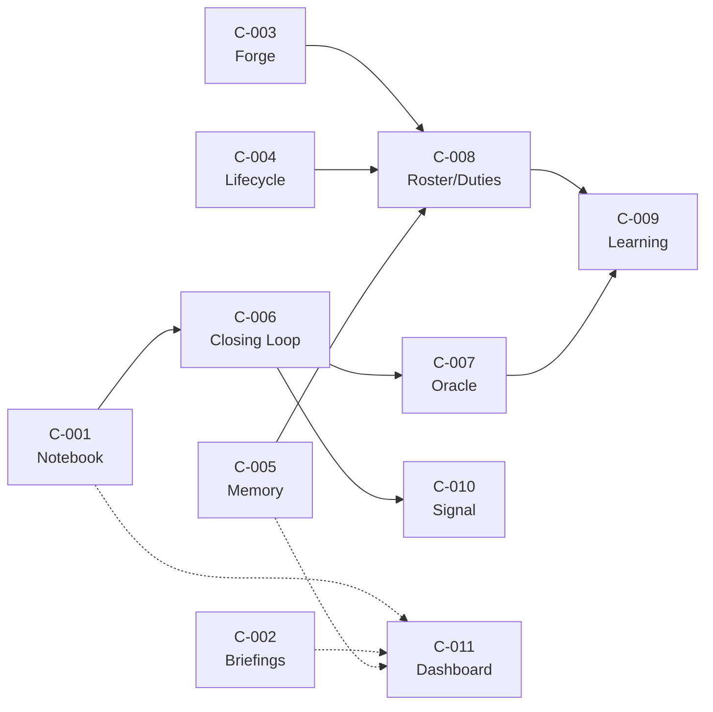

# Engine Modules

> **Scope**: Canonical reference for Conclave's 11 engine modules (C-001..C-011).
> Other architecture docs link here for module detail — do not duplicate this table.
> **Source material**: `migration-bootstrap.md` R2 (consolidation table + build order),
> VISION.md §4, `project-context.md` (module map)
> **Cross-refs**: [`roster-and-forge.md`](roster-and-forge.md) (C-003, C-008),
> [`memory-and-knowledge.md`](memory-and-knowledge.md) (C-002, C-005)

---

## Module table

| ID | Module | Conclave spec | Absorbs (VoidPay) | What it owns | Maturity | Dependencies |
|----|--------|--------------|-------------------|-------------|----------|-------------|
| **C-001** | Notebook | C-001 | 086 (impl); 052+077 superseded | emit → index → weekly triage → archive; feedback JSONL store; `/team.feedback` + `/team.feedback-triage` skills | done (code ready) | — |
| **C-002** | Briefings | C-002 | 084 | `briefing-build` Python; per-advisor `.md` cache; `hot.md`; `_team.md` digest; 3-layer regen triggers | done (code ready) | C-005 (runtime read) |
| **C-003** | Forge | C-003 | 049, 070; 071+072 as tasks | hire/evolve/audit protocols; facilitation mode; contracts; templates; ARCHITECTURE.md | in-progress (port + absorb) | — |
| **C-004** | Lifecycle | C-004 | 085; 076-Ph0; 078/079/081 B-criteria as requirements | `team.start / processing / done / handoff` skills; session boundary enforcement | in-progress (port clean) | C-003 (Forge), C-005 (writes) |
| **C-005** | Memory | C-005 | 051; 080 B39–B43 as requirements | `agent-memory/` tree; session/decision/mention scripts; `gh-fetch.sh` snapshot writer; GH Issues as truth | in-progress (port + gates) | — |
| **C-006** | Closing Loop | C-006 | 093 (canonical home: Conclave) | verify/close pipeline; feedback status machine; auto-close resolved items; produce mutation nominations | active | C-001 |
| **C-007** | Oracle | C-007 | 089 (~30% built, design-locked) | autonomous evaluation pipeline; P6 spine (scout→ranker→critic→judge); external falsification signal | in-progress | C-001, C-006 |
| **C-008** | Roster/Duties | C-008 | 091 (design-locked, no 089 dep) | deontic duty registry; roles + missions + norms; MOISE+ model; L1 human-gated self-write | design-locked | C-003, C-004, C-005 |
| **C-009** | Learning | C-009 | 090 (stub) | oracle-falsified lesson acquisition; importance-threshold reflection; Ebbinghaus decay; lesson-failed → revise/retire | stub (blocked) | C-007 (L2/L3), C-008 (L1) |
| **C-010** | Signal | C-010 | 094 (design-locked) | structured signal channel; bridges notebook and oracle; signal schema + routing | design-locked | C-001, C-006 |
| **C-011** | Dashboard | C-011 | 102 (verified design, not built) | read-only local debug dashboard over the DATA tree (FastAPI+HTMX); operator inspects advisor context; v1.1 MCP adapter | design-locked | C-001, C-002, C-005 |

---

## Per-module descriptions

### C-001 — Notebook

The entry point for all structured feedback. Every session writes one or more feedback items
via `feedback_emit.py`, which writes one **per-session Markdown review with YAML frontmatter**
under `ops/feedback/<date>/<agent>-<session>.md`. The `feedback_index.py` script *derives* the
rolling `_index/index.jsonl` (all non-archived items) from those review files — the JSONL is the
index, not the store. Weekly triage
runs `feedback_triage.py`, which surfaces open items by severity and age, and
`feedback_archive.py` folds resolved items out of the live index.

The two lifecycle skills — `/team.feedback` (emit at session end) and
`/team.feedback-triage` (weekly cadence) — are the human-facing surfaces of this module.
Everything else is script-driven. The status enum is
`open, accepted, in_progress, resolved, re-occurred, rejected, deferred` (there is no
`pending` state; `archived` is a separate fold-out operation, not a status). The critical
gap that motivated C-006 is the `accepted → resolved` transition: on the live 339-row index
(measured 2026-06-11) the distribution is **71 `accepted` / 21 `resolved` / 131 `deferred`
/ 98 `rejected` / 18 `open`** (229 of 339 already triaged out). `resolved` requires a manual
`--set`, so the accepted→resolved pass stalls. C-006 automates that pass.

**VoidPay origin**: spec 086, shipped May 2026. Supersedes spec 052 (advisor journal) and
spec 077 (skill-feedback). Code is in `scripts/feedback/` (9 `.py` files — 7 `feedback_*` modules + `schema.py`/`paths.py` — and 11 test files,
pydantic v2 + ruamel).

---

### C-002 — Briefings

The cache layer over the append-only memory source. `briefing-build` (Python, pydantic v2
+ ruamel) reads from `agent-memory/advisors/` and GH Issues (via the `gh-cache/` snapshot)
and generates a per-advisor Markdown briefing. The eager slot (≤500 words) is injected at
every `/team.start`; the archival slot is available on demand.

Additional outputs: `hot.md` (≤500 words, cross-advisor live state, de-duped) and
`_team.md` (cross-advisor digest for Forge facilitation — ~500 tokens total, avoids loading
5 full briefings for a meeting start).

Three regen triggers: mutation scripts (any write via `close-session.sh`, `file-decision.sh`,
`mention.sh`), post-commit hook, and `team.start` build-and-compare (always rebuilds, writes
only if content differs). Editing a briefing directly is always wrong — it is overwritten on
the next `/team.start`.

**VoidPay origin**: spec 084, shipped May 2026. Briefing total −41% (124,606 → 73,823 chars)
despite +13 enrichment sections. Cap: 6,000 tokens advisory.

---

### C-003 — Forge

The agent factory and meta-role. Three factory protocols: `hire` (scaffold new advisor from
templates, patch project-context + constitution, run briefing-build, register); `evolve`
(mutate existing advisor — voice, scope, toolbox, contracts — per-aspect commits with
diff-preview); `audit` (detect advisor drift — scope creep, voice collapse, contract
violations). A fourth protocol: `facilitate` (meeting orchestration absorbed from Quorum —
phase protocol, minutes, issue triage, cross-advisor routing).

Forge is always-present infrastructure — seeded at init, never hired or dismissed. It has a
position on *how the system is built*; it stays neutral on *what the system produces*. Mode
(factory vs facilitation) is detected at session start and not toggled mid-session.

**VoidPay origin**: spec 049, shipped May 2026. 528-LOC ARCHITECTURE.md with 4 Mermaid
diagrams; 46-script responsibility table; Quorum facilitation absorbed 2026-06-11 per
migration-bootstrap locked decision #2.

---

### C-004 — Lifecycle

The mandatory session ritual: `start → processing → done → handoff`. Skipping `done` is
drift — un-closed work corrupts the record. Every advisor runs this sequence independently;
Forge is not required to coordinate it.

`team.start` loads context (project-context, constitution, advisor briefing, hot.md).
`team.processing` detects mode and invokes the skill chain already identified by `team.start`.
`team.done` writes session record, syncs GH issues, updates hot.md. `team.handoff` creates a
structured resume-prompt if work is incomplete.

VoidPay spec 085 contained lifecycle simplification; 078/079/081 were B-criteria stubs
that fold into C-004 requirements rather than becoming separate modules.

**VoidPay origin**: spec 085, lifecycle skills `team.start/processing/done/handoff`.
076-Phase 0 (bash extraction, 436 BATS tests) ported as implementation substrate.

---

### C-005 — Memory

The append-only source of truth. Five record types, each with a dedicated write script.
The GH Issues integration (`gh-fetch.sh`) runs as a dedicated snapshot writer so that
`briefing-build` has zero live `gh` calls — the file-as-message-bus principle applied to
the VCS/issues layer.

One-commit-per-session discipline: all `agent-memory/` writes for a session aggregate into
a single commit at `/team.done`. Nothing in `agent-memory/advisors/**` is edited by hand.

Per-executor memory is lighter: a single `MEMORY.md` (≤50 lines) per executor type under
`agent-memory/executors/<id>/`.

**VoidPay origin**: spec 051. 080 B39–B43 criteria (memory gates for advisors) become
C-005 acceptance requirements rather than a separate module.

---

### C-006 — Closing Loop

The smallest shippable slice that proves the self-improvement thesis and pays for itself
by draining the backlog. The loop runs after triage (C-001) and answers one question per
item: *did the world change to match this feedback?*

Two outputs from one verification signal:
- **Closing loop** (cheap): item already fixed on disk → transition `accepted → resolved →
  archived`. Automated.
- **Learning loop** (heavier): same pattern recurs and holds → produce a mutation
  nomination for a skill/contract/briefing → human-gated promotion via Forge.

The closing loop does not self-promote lessons. It produces nominations; C-008 (L1) or
C-009 (L2/L3) consume them. The oracle (C-007) provides the external falsification signal
that guards against wrong nominations.

> **Nomination-routing flag (2026-06-11)**: the live code hardcodes nominations to **090**
> (the oracle path), which is blocked. The intended consumer per this architecture is
> **C-008 (L1, human-gated)**. The migration should **re-wire nominations to L1** so the
> closing loop produces value before the oracle is built — do not leave them routed to a
> blocked module.

> **Maturity (2026-06-11)**: `feedback_verify.py` is **~150 LOC and complete** — not a stub.
> It is **starved**: no `verify:` predicates are authored and `hit_count` is never written,
> so it yields 0 auto-closes and 0 nominations on the live 339-row index. C-006 needs
> *feeding* (author predicates, wire `hit_count`, re-route nominations to L1), not building.

**Conclave-canonical**: spec 093. The canonical home for 093 is Conclave (not VoidPay) —
it was designed as a Conclave component that dogfoods on VoidPay's feedback store.

---

### C-007 — Oracle

The external verifier. An autonomous evaluation pipeline (spec 089) structured as a P6
spine: Scout (read-only research) → Ranker (best-of-N filter) → Critic (red-team
refutation) → Judge (binding verdict). The oracle provides the falsification signal that
guards C-009 (L2/L3 learning) — a lesson is never promoted to a durable change without
passing the oracle.

The science is explicit in the constitution (§V): intrinsic self-correction degrades;
durable self-improvement requires a signal from outside the agent. C-007 is that signal.

C-007 at ~30% built in VoidPay (design-locked). The four executor agents (Scout, Ranker,
Critic, Judge) are classified PORTABLE in the migration inventory and lift clean.

**VoidPay origin**: spec 089. Research corpus: 13 research rounds (~4,517 lines), held in the
authoring instance's private research tree.

---

### C-008 — Roster/Duties

The deontic duty registry. Formalises what each agent role *must*, *may*, and *must not*
do — roles, missions, and norms in a MOISE+ style model. Two ownership layers: Forge
writes the base duties at hire time; agents can self-write their own duty extensions
(human-gated via Forge audit).

L1 learning (human-gated self-write): when a lesson is nominated by C-006 and passes the
confidence threshold, an advisor proposes a norm-diff to their own SKILL.md or a contract.
Forge reviews and gates. This is the *reflexion → human-approved norm-diff → self-write*
cycle that constitutes durable self-improvement at L1.

C-008 has no dependency on C-007 (the oracle). L1 requires only human approval, not oracle
falsification. The oracle gate is the L2/L3 threshold (C-009).

**VoidPay origin**: spec 091, design-locked 2026-06-09. Described as "the spin-out unit"
in the spec itself.

---

### C-009 — Learning

The highest-stakes module. Produces durable mutations to agent skills, contracts, and
briefings from externally-verified patterns.

Two learning layers:
- **L1** (human-gated, C-008): reflexion → human-approved norm-diff → self-write. No oracle
  required. Operates on any nominated lesson.
- **L2/L3** (oracle-gated, C-007 dep): importance-threshold reflection + auto-extract for
  high-confidence, externally-falsified patterns. Never promotes without oracle signal.

Decay model: 30 days unreinforced → lesson steps down (Ebbinghaus). `re-occurred →
lesson-failed → revise/retire` path prevents local minima. Wrong lessons are demoted with
provenance, never silently deleted.

**Status**: stub. Blocked on C-007 (oracle for L2/L3) and C-008 (duty registry for L1).

---

### C-010 — Signal

The structured signal channel that formalises what counts as a verifiable signal and how it
routes from the notebook (C-001) and closing loop (C-006) into the oracle (C-007) and
learning layer (C-009). Defines signal schema, routing rules, and the confidence-graduation
table (deterministic → auto-act; fuzzy → propose; high-stakes → always human-gated).

**Status**: design-locked (spec 094). Becomes active after C-001 and C-006 are running.

---

### C-011 — Dashboard

A debug-first, read-only local web dashboard (FastAPI + Jinja2 + HTMX) over the `.conclave/`
DATA tree: the operator inspects what context an advisor has and why — briefings, hot.md,
feedback state, sessions/decisions, freshness — without hand-reading files. Built on a shared
`enginelib/readmodel/` layer whose pydantic view-models also back a v1.1 FastMCP adapter.
Explicitly an internal operator/debugging instrument, **not** a product-facing SaaS dashboard
(re-scoped from the earlier Track-B framing per spec 102).

**Status**: design-locked — spec 102 (a working document, private to the authoring instance), judge-verified
(conditionally_fit 0.82); implementation not started. Depends on C-001 (notebook), C-002
(briefings), and C-005 (memory).

---

## Build-order graph

The build order from R2 — four parallel chains that converge at C-009:

Solid arrows = blocking dependency (cannot start without). Dashed = runtime dependency
(needed when running, not when building).

---

## Maturity legend

| Maturity | Meaning |
|---------|---------|
| **done** | Code complete in VoidPay; needs port + config-strip to Conclave |
| **in-progress** | Partially built; active work ongoing |
| **active** | Being built now; canonical home is Conclave |
| **design-locked** | Design complete; no blocking unknowns; implementation not started |
| **stub** | Placeholder; blocked on upstream module(s) |
| **deferred** | Explicitly deferred to Track B or later phase |
