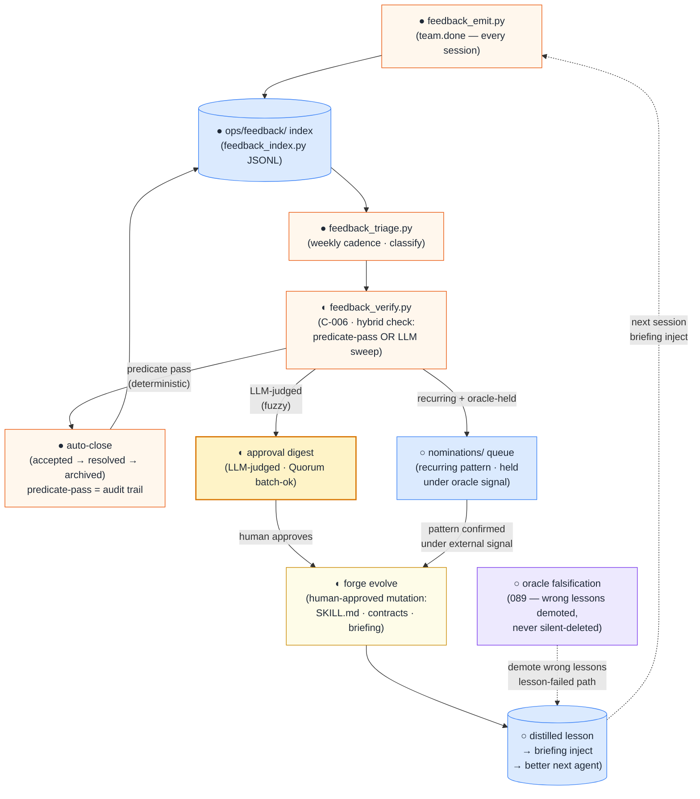
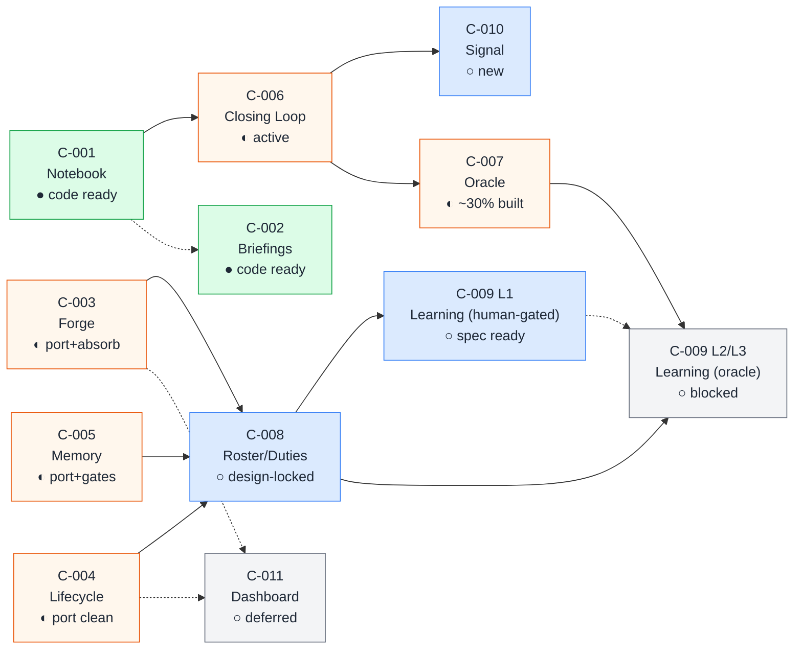

# Conclave — Engine Architecture Overview

> **Single question this doc answers:** "How does the whole engine fit together — from a session
> keystroke to a durable improvement to an agent's own SKILL.md?"
>
> Per-module detail belongs to [`engine-modules.md`](engine-modules.md). This doc is the synthesis:
> substrates, the self-improvement loop, and how the 11 modules compose into it.

---

## 1. Two substrates that everything else runs on

Every design choice in the engine traces to two constitutional principles. They are load-bearing —
violating either breaks memory trustworthiness or auditability.

### Constitution I — File-as-message-bus

LLMs write per-template Markdown files. Scripts aggregate, index, and verify. No live `gh`/`git`
calls happen during reasoning — all external data enters through dedicated snapshot writers
(`gh-fetch.sh`, `git-fetch.sh`) before a session starts. All mutations flow through
shell/Python scripts that write Markdown.

Consequences:
- Every automated action leaves a file trail — auditable and replayable.
- LLM errors are bounded to a single file write, not to side-effecting network calls.
- The bus composes: any consumer (briefing regen, feedback index, triage) reads the same files.

Forbids: agents issuing live network or VCS calls mid-reasoning; state that exists only in a model
context and nowhere on disk.

### Constitution II — Cache over source of truth

| Layer | Contents | Property |
|-------|----------|----------|
| **Source of truth** | GH issues, `sessions/`, `decisions/`, `mentions/`, `ops/feedback/` | Append-only, never hand-edited |
| **Cache** | Per-advisor `briefings/<advisor>.md`, `hot.md` | Regenerable; stale cache = rebuild, not authority |

When a briefing and the GH issue tracker disagree, the GH issue wins and the briefing rebuilds.
Briefings are not editable by hand — they are script-generated by `briefing/regen.py` (C-002).

Forbids: treating a stale briefing as authoritative; hand-editing a generated briefing.

---

## 2. The session loop (how memory stays fresh)

Before reaching the self-improvement loop, every session passes through the same file-bus circuit:

```
External sources (GH + git repo)
        │
        ▼
snapshot writers (gh-fetch.sh · git-fetch.sh)   ← sole gh/git call sites
        │
        ▼
  gh-cache + git-cache
        │
        ▼
  session_init.py  ──── briefing build-and-compare (rebuild always, write if changed)
        │
        ▼
  Advisor context window
  (briefing + hot.md + handoffs + reflexion priors)
        │
        ▼
  Session writers (team.done)
  close-session · file-decision · mention · feedback_emit · GH sync
        │
        ▼
  sessions/ · decisions/ · mentions/ · ops/feedback/
        │
        ▼
  briefing/regen.py  ──────────────────►  briefings/<advisor>.md
                                                │
                                         (NEXT SESSION INPUT)
```

`hot.md` (≤500 words) runs as a best-effort live delta — every session writer ticks into it.
Wiki vault (`knowledge/`) is a read-on-demand side-rail for durable concepts.

The loop diagram from the mirrored audit diagrams is the canonical visual reference:
[`../research/_mirror/audits/2026-06-04-team-system-sweep/diagrams/01-context-and-today.md`](../research/_mirror/audits/2026-06-04-team-system-sweep/diagrams/01-context-and-today.md)
(Block B — LIVE Session Loop).

---

## 3. The self-improvement loop

This section (with `engine-modules.md`) is the canonical mechanism definition. VISION §3 is the
*founding* sketch and is pre-correction — defer to the corrected docs here on any conflict. The
mermaid below renders the loop as a flowchart; the prose explains each node's decision authority.



### Decision authority at each node

| Node | Signal type | Authority |
|------|-------------|-----------|
| `feedback_emit.py` | Per-session structured review | Automatic (agent, mandatory) |
| `feedback_triage.py` | Cadence classification | Semi-automatic (Forge facilitates) |
| `feedback_verify.py` | Deterministic predicate / LLM sweep | Deterministic → auto; fuzzy → propose |
| Auto-close | Predicate passes | **Automatic** — predicate is the audit trail |
| Approval digest | LLM-judged resolution | **Human approval** required |
| Forge evolve (skill/contract mutation) | Any | **Always human-gated** (constitution V) |
| Oracle falsification | External verifier signal | 089 pipeline |

---

## 4. Two-output split

One verification signal produces two outputs at different cost points. The split is deliberate —
the cheap loop ships without the heavy infrastructure the oracle requires.

| Output | What it does | Cost | Dependency |
|--------|-------------|------|-----------|
| **Closing loop** | Drains `accepted` backlog; marks already-fixed items `resolved` | Cheap — predicate check or bounded LLM sweep | None (C-006 standalone) |
| **Learning loop** | Promotes recurring patterns to durable skill/contract mutations | Heavy — requires external verifier to guard against intrinsic self-correction degradation | C-007 (Oracle) + C-008 (Roster/Duties) |

The science behind the split is unambiguous: durable self-improvement requires an external
verifier (constitution V). Intrinsic self-correction degrades — the model's own confidence is
not a reliable signal for promoting a lesson to permanent status.

**The closing loop pays for itself immediately**: as of the bootstrap analysis (2026-06-11), the
live 339-row index had **71 `accepted` items and only 21 `resolved`**. The majority of `accepted`
items are already fixed on disk — they were never marked because there was no automated verify pass.

**Guardrails on the learning loop** (constitution VII):

| Failure mode | Guard |
|-------------|-------|
| Memory poisoning | Provenance + rerank on every recalled lesson |
| Lesson bloat | Lesson cap + Ebbinghaus decay: 30 days unreinforced → step down |
| Local minima | `re-occurred → lesson-failed → revise/retire` path |
| Scope creep | Guards scoped per task-type, not global |

---

## 5. Module composition

The 11 modules are not a flat list — they form a dependency graph with a deliberate build order.
Modules on the left unblock modules on the right.



**Build order (from R2 analysis):**
1. `C-001 → C-006 → C-010` — the fast path; no oracle dependency
2. `C-002` — independent; runs in parallel with the fast path
3. `{C-003, C-004, C-005} → C-008 → C-009 L1` — Forge/Lifecycle/Memory platform, then duties, then human-gated learning
4. `C-006 → C-007 → C-009 L2/L3` — the closing loop's nominations feed the oracle; heavy oracle-gated path, blocked until 089 is further built

Per-module depth (purpose, contracts, scripts, status) belongs to [`engine-modules.md`](engine-modules.md).

---

## 6. Current build state

| Module | Conclave spec | Absorbs | State |
|--------|---------------|---------|-------|
| Notebook | C-001 | 086 | code ready |
| Briefings | C-002 | 084 | code ready |
| Forge | C-003 | 049, 070 | port + absorb (Quorum facilitation absorbed) |
| Lifecycle | C-004 | 085; 076-Ph0 | port clean (085 cleanup done inside Conclave) |
| Memory | C-005 | 051 | port + gates |
| Closing Loop | C-006 | 093 (canonical home = Conclave) | active |
| Oracle | C-007 | 089 (~30% built, design-locked) | continue |
| Roster/Duties | C-008 | 091 (design-locked, no 089 dep) | spec ready |
| Learning L2/L3 | C-009 | 090 (stub) | blocked on C-007+C-008 |
| Signal | C-010 | 094 (design-locked) | new after C-001 |
| Dashboard | C-011 | 075 (Track B) | deferred |

**Key coupling blockers** identified in R1 research (must patch before Conclave runs independently):
- `create-advisor.sh:7` + `register-advisor.sh:7` — hardcoded `PROJECT_ROOT=~/code/voidpay`
- `briefing/paths.py` + `paths.sh` — `VOIDPAY_AI_ROOT` env var
- `team.done:109` — absolute path hardcoded
- `github-issues-protocol.md` — entire file is VoidPay-specific (owner/repo/board IDs)

Config knobs to introduce: `CONCLAVE_ROOT`, `ENGINE_ROOT` (`.ai/` for VoidPay, empty for Conclave
native), `roster.yaml`, `${PROJECT_NAME}`, `${PROJECT_CONTEXT_PATH}`, `${TEAM_LANGUAGE}`,
`stack-profile`.

---

## 7. Diagram reference

The mirrored audit diagrams provide the authoritative visual baseline for the live system:

| Diagram | Question | Path |
|---------|----------|------|
| V1 Block A | Static 3-layer architecture | `_mirror/audits/…/diagrams/01-context-and-today.md` |
| V1 Block B | Session loop data-flow | same file |
| V2 | LIVE → TARGET delta | `02-delta.md` |
| V3 | End-to-end request spine (P0–P8) | `03-run-spine.md` |
| V4 | Verify subsystem (P6 DAG) | `04-verify-zoom.md` |
| V5 | Failure modes and resume | `05-failure-and-resume.md` |
| V6 | Forge kernel + 090 return loop | `06-build-and-learn.md` |

Scope note: all V1–V6 diagrams are **089/090 internal, pre-091** — the plugin-extraction
boundary (091 Roster/Duties) is not reflected there. This overview incorporates the 091 design
as C-008.
