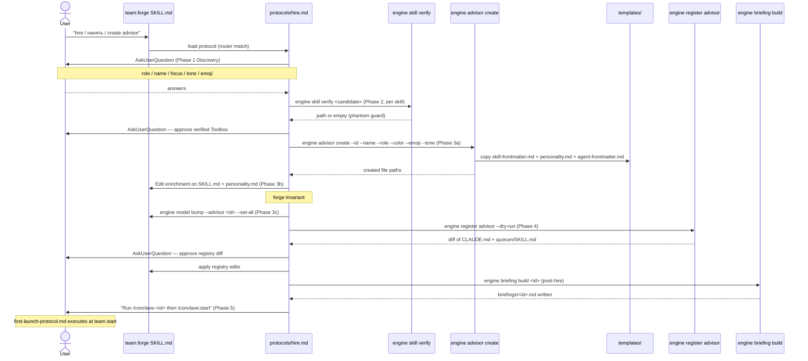
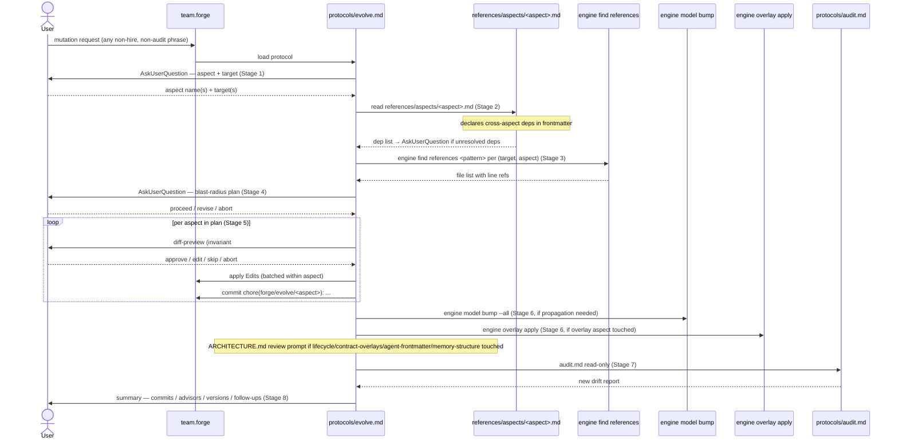
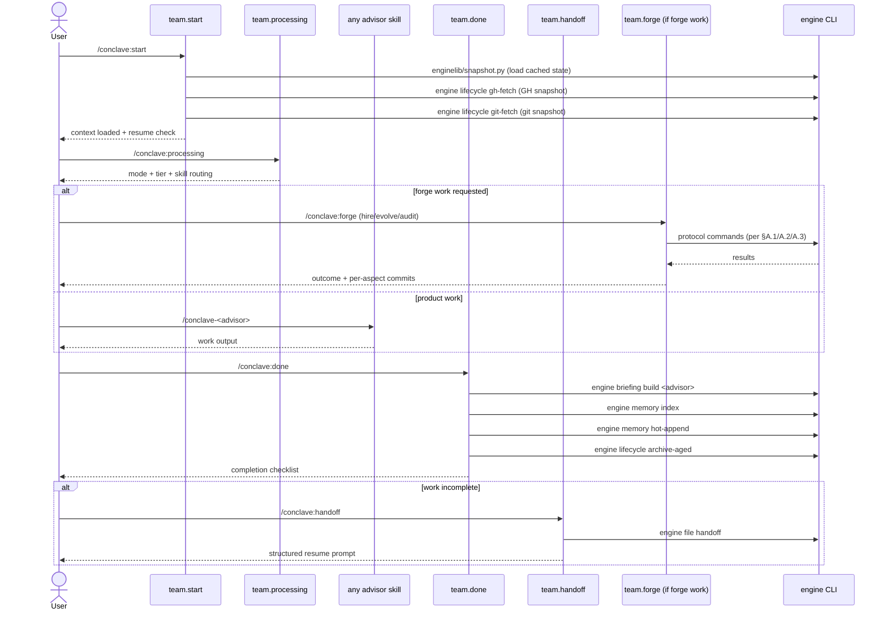
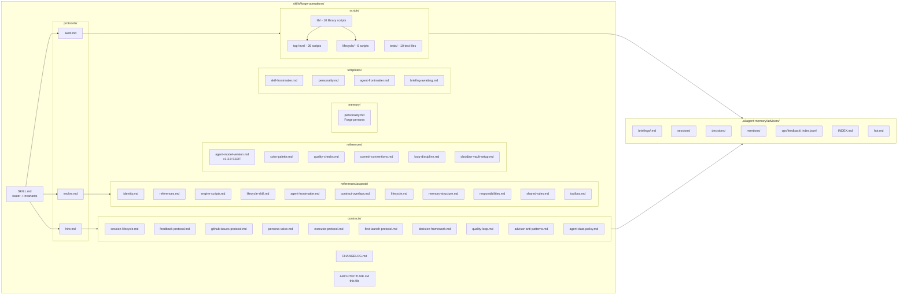
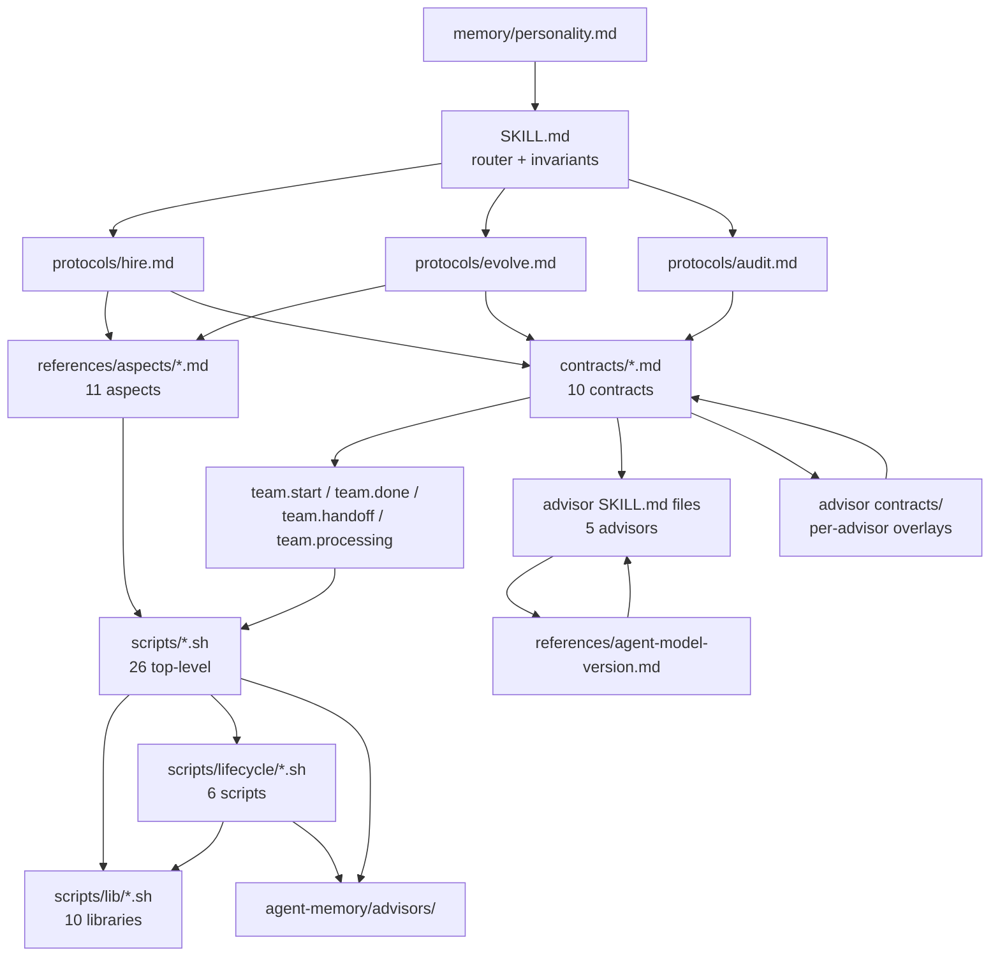

# Forge Architecture (As-Built)

> **Navigation**: This file answers HOW forge works internally.
> For WHEN to invoke forge see `SKILL.md`.
> For WHY this design was chosen see spec 049 — team-forge (internal design record).

---

## §A — How does process X work?

### A.1 Hire protocol (5 phases)



### A.2 Evolve protocol (8 stages)



### A.3 Audit protocol (9 categories + fix-mode)

```mermaid
sequenceDiagram
    actor User
    participant Forge as team.forge
    participant Audit as protocols/audit.md
    participant AV as engine audit versions
    participant AP as engine audit phantom-skills
    participant AB as engine audit bloat
    participant AR as engine audit registry-consistency
    participant AOv as engine audit overlays
    participant AAC as engine audit agent-configs
    participant SS as engine skill stocktake
    participant Evolve as protocols/evolve.md

    User->>Forge: "audit / check drift / проверь consistency"
    Forge->>Audit: load protocol (router match)
    Note over Audit: read-only by default; --fix delegates to Evolve

    Audit->>AV: engine audit versions (cat.1: version alignment)
    Audit->>AP: engine audit phantom-skills (cat.2: phantom skills)
    Audit->>AB: engine audit bloat (cat.3: line-count limits)
    Note over Audit: cat.4: inline grep — required sections check
    Audit->>AR: engine audit registry-consistency (cat.5: registry)
    Audit->>AOv: engine audit overlays (cat.6: overlay health)
    Note over Audit: cat.7: inline — contract integrity
    Audit->>AAC: engine audit agent-configs (cat.8: config safety)
    Audit->>SS: engine skill stocktake (cat.9: advisory verdicts)

    Audit->>User: findings by (category, severity, target)

    alt --fix mode
        Audit->>Evolve: delegate per fix-mode table
        Note over Evolve: version_alignment → evolve(aspect=<missing>)
        Note over Evolve: bloat → evolve(aspect=identity+responsibilities)
        Note over Evolve: overlay_drift → evolve(aspect=contract-overlays)
    end
```

### A.4 Session lifecycle with forge integration points



---

## §B — Where is X stored?

### B.1 Concept map



### B.2 Script responsibility table

Spec 099 ported the shell layer to Python and **no `*.sh` file remains in this repository**.
Every row below is therefore a retirement record, not a description of something that runs.
The columns that used to hold measured behaviour — invoked-by, reads, writes, side-effects —
were measured against the shell implementation and are not carried over under a new name: a
Python successor's I/O is a fresh claim and belongs to the module that makes it, not to this
table. What this table is good for now is the migration: old name → what to call instead.

> The previous version of this sentence read *"All 59 non-test scripts. Row count equals
> `find scripts -name '*.sh' -not -path '*/tests/*' | wc -l`"*. That command returns **0**.
> A document that states its own invariant in executable form is worth more than one that
> does not — this one was falsifiable, and it was false for four months.

#### Top-level scripts — all retired

| Script | Successor | Reads | Writes | Side-effects |
|--------|-----------|-------|--------|--------------|
| apply-overlay.sh | **retired (spec 099)** — `engine overlay apply` | — | — | — |
| archive-feedback.sh | **deleted (spec 086)** — `engine/scripts/feedback/feedback_archive.py` | — | — | — |
| audit-agent-configs.sh | **retired (spec 099)** — `engine audit agent-configs` | — | — | — |
| audit-bloat.sh | **retired (spec 099)** — `engine audit bloat` | — | — | — |
| audit-overlays.sh | **retired (spec 099)** — `engine audit overlays` | — | — | — |
| audit-phantom-skills.sh | **retired (spec 099)** — `engine audit phantom-skills` | — | — | — |
| audit-registry-consistency.sh | **retired (spec 099)** — `engine audit registry-consistency` | — | — | — |
| audit-versions.sh | **retired (spec 099)** — `engine audit versions` | — | — | — |
| briefing-build.sh | **retired (spec 099)** — `engine briefing build` | — | — | — |
| bump-model-version.sh | **retired (spec 099)** — `engine model bump` | — | — | — |
| close-session.sh | **retired (spec 099)** — `engine session close` | — | — | — |
| evolve-feedback.sh | **deleted (spec 086)** — channel C dead loop removed; no successor | — | — | — |
| file-decision.sh | **retired (spec 099)** — `engine file decision` | — | — | — |
| file-handoff.sh | **retired (spec 099)** — `engine file handoff` | — | — | — |
| find-references.sh | **retired (spec 099)** — `engine find references` | — | — | — |
| hot-md-append.sh | **retired (spec 099)** — `engine memory hot-append` | — | — | — |
| hot-md-init.sh | **retired (spec 099)** — `engine memory hot-init` | — | — | — |
| memory-index.sh | **retired (spec 099)** — `engine memory index` | — | — | — |
| mention.sh | **retired (spec 099)** — `engine mention create` | — | — | — |
| migrate-foundations-to-wiki.sh | **retired (spec 099)** — no successor built; see spec 121 | — | — | — |
| normalize-spec-frontmatter.sh | **retired (spec 099)** — `engine spec normalize-frontmatter` | — | — | — |
| register-advisor.sh | **retired (spec 099)** — `engine register advisor` | — | — | — |
| register-executor.sh | **retired (spec 099)** — `engine register executor` | — | — | — |
| report-issue.sh | **deleted (spec 086)** — `engine/scripts/feedback/feedback_emit.py` + `/conclave:feedback` | — | — | — |
| resolve-mention.sh | **retired (spec 099)** — `engine mention resolve` | — | — | — |
| skill-stocktake.sh | **retired (spec 099)** — `engine skill stocktake` | — | — | — |
| summarize-feedback.sh | **deleted (spec 086)** — `engine/scripts/feedback/feedback_triage.py --digest` | — | — | — |
| verify-skill.sh | **retired (spec 099)** — `engine skill verify` | — | — | — |

Two rows that were already commands rather than scripts keep their place: `engine advisor create`
(hire.md Ph3a, scaffolds the `skills/team.<id>/` tree) and `engine inbox to-issues` (prints the
`gh issue create` commands for a legacy `topics/inbox.md`; `--execute` is required to run them).

#### lib/ scripts — all retired into `enginelib/`

| Script | Successor | Purpose it served |
|--------|-----------|-------------------|
| lib/advisors.sh | **retired (spec 099)** — `enginelib/advisors.py` | Canonical advisor inventory |
| lib/feedback.sh | **deleted (spec 086)** — no remaining consumer | — |
| lib/frontmatter.sh | **retired (spec 099)** — `enginelib/frontmatter.py` | Read/write YAML frontmatter |
| lib/gh-query.sh | **retired (spec 099)** — `enginelib/gh.py` | gh CLI wrappers |
| lib/obsidian-parse.sh | **retired (spec 099)** — `enginelib/obsidian.py` | Obsidian markdown primitives |
| lib/paths.sh | **retired (spec 099)** — `enginelib/paths.py` | Path constants and directory helpers |
| lib/run-log.sh | **retired (spec 099)** — `enginelib/runlog.py` | Append-on-exit JSONL observability |
| lib/slug.sh | **retired (spec 099)** — `enginelib/slug.py` | Slug-ification and id generators |
| lib/snapshot.sh | **retired (spec 099)** — `enginelib/snapshot.py` | Concurrency-safe atomic write, TTL |
| lib/template.sh | **retired (spec 099)** — `enginelib/template.py` | Render `{{key}}` placeholders |

#### lifecycle/ scripts — all retired

| Script | Successor |
|--------|-----------|
| lifecycle/archive-aged.sh | **retired (spec 099)** — `engine lifecycle archive-aged` |
| lifecycle/gh-fetch.sh | **retired (spec 099)** — `engine lifecycle gh-fetch` |
| lifecycle/git-fetch.sh | **retired (spec 099)** — `engine lifecycle git-fetch` |
| lifecycle/migrate-add-tags.sh | **retired (spec 099)** — `engine lifecycle migrate-add-tags` |
| lifecycle/migrate-add-type.sh | **retired (spec 099)** — `engine lifecycle migrate-add-type` |
| lifecycle/resolve-finding.sh | **retired (spec 099)** — `engine lifecycle resolve-finding` |

#### wiki/ scripts — all retired, **none replaced**

Spec 074 Phase 2 designed seven wiki scripts. None was ported and none exists; `engine/scripts/wiki/`
is absent from the tree. `commands/done.md` states they moved to the `/wiki:*` plugin — that was
checked on 2026-09-18 and is not so: the plugin ships 22 shell scripts, none of these seven, and it
sits in `_quarantine/`. The Study phase that orchestrates them is the subject of **spec 121**, whose
P1 is the operator's choice between retiring the phase and rebuilding it. Until that is decided no
successor can be named here, because whether there should be one is the open question.

| Script | Successor |
|--------|-----------|
| wiki/promote-decision.sh | **retired (spec 099)** — none; blocked on spec 121 |
| wiki/wiki-audit-stale.sh | **retired (spec 099)** — none; blocked on spec 121 |
| wiki/wiki-bridge-rebuild.sh | **retired (spec 099)** — none; blocked on spec 121 |
| wiki/wiki-capture-suggest.sh | **retired (spec 099)** — none; blocked on spec 121 |
| wiki/wiki-frontmatter-validate.sh | **retired (spec 099)** — none; blocked on spec 121 |
| wiki/wiki-hot-sync.sh | **retired (spec 099)** — none; blocked on spec 121 |
| wiki/wiki-link-check.sh | **retired (spec 099)** — none; blocked on spec 121 |

#### skill-feedback/ scripts — **deleted (spec 086)**

All four scripts — `emit.sh`, `aggregate.sh`, `hash-skill.sh`, `audit.sh` — and the `skill-feedback/` directory were **removed** in spec 086. Channel B (executor skill
feedback) is now handled by `engine/scripts/feedback/feedback_emit.py` + `/conclave:feedback`.

#### tests/ — **removed** with the scripts they covered

Ten bats files were **deleted** with their subjects: `apply-overlay.test.sh`, `audit-bloat.test.sh`, `audit-phantom-skills.test.sh`, `audit-registry-and-overlays.test.sh`, `audit-versions.test.sh`, `bump-model-version.test.sh`, `create-advisor.test.sh`, `find-references.test.sh`, `register-advisor.test.sh`, `verify-skill.test.sh`. Coverage moved to the pytest suite
under `engine/scripts/tests/`, where `tests/cmd/` holds the adapter-level ports.

---

## §C — What breaks if I change X?

### C.1 Reverse-dependency map



### C.2 Impact-class table

| Change type | Likely affected zones | Recommended audit |
|-------------|----------------------|-------------------|
| Edit SKILL.md router logic | hire.md / evolve.md / audit.md dispatch | manual smoke test all 3 protocols |
| Edit protocols/hire.md | templates/, scripts called in Ph1-5, first-launch-protocol.md | run `engine advisor create` (manual smoke test — no `--dry-run` flag exists) |
| Edit protocols/evolve.md | aspects/ load order, `engine model bump` invocation, ARCHITECTURE.md §A.2 | `engine audit versions` + manual evolve smoke |
| Edit protocols/audit.md | every `engine audit <name>` check, quality-loop.md, fix-mode delegation | `engine audit --list`, then run each |
| Add a new `engine` subcommand | ARCHITECTURE.md §B retirement map | `engine audit architecture-doc` |
| Edit any contracts/*.md | all advisor SKILL.md (overlay check) + lifecycle skills | `engine audit overlays` + `engine audit registry-consistency` |
| Edit contracts/session-lifecycle.md | all 5 advisor session flows + Kai overlay | `engine audit overlays` |
| Edit contracts/feedback-protocol.md | `engine/scripts/feedback/feedback_emit.py`, `feedback_triage.py`, `feedback_archive.py`, `/conclave:feedback`, `/conclave:triage` | run pytest for `engine/scripts/feedback/` |
| Edit contracts/persona-voice.md | all 5 advisor SKILL.md Voice Signature blocks | `engine audit versions` (check last-evolve stamps) |
| Edit references/agent-model-version.md | all 5 advisor SKILL.md forge.model-version stamps | `engine audit versions` |
| Bump agent-model semver | all 5 advisor SKILL.md forge: frontmatter | `engine model bump --all` + `engine audit versions` |
| Edit memory/personality.md (Forge persona) | Forge voice in all sessions | manual spot-check |
| Edit references/aspects/<aspect>.md | evolve.md Stage 2 aspect loading + all callers | `engine find references <aspect-name>` |
| Edit `enginelib/<module>.py` | every importer of that module | `pytest engine/scripts/tests/` |
| Edit `engine lifecycle gh-fetch` | `engine briefing build` (reads gh-cache), team.start context load | `engine briefing build <advisor>` |
| Edit advisor SKILL.md contracts/ overlay | base contract in ${CLAUDE_PLUGIN_ROOT}/skills/advisor-contracts/references/ | `engine audit overlays` |
| Move memory paths (agent-memory/) | `engine briefing build`, `engine session close`, `engine memory index`, `engine mention create`, `enginelib/paths.py` | `pytest engine/scripts/tests/` + `engine briefing build <advisor>` |

---

## §D — Why is it this way?

### D.1 Contracts live inside team.forge, not at repo root

**Context**: Early advisor architecture placed contracts at `.ai/.claude/contracts/` (repo-root adjacency). Spec 049 §4 moved them into `${CLAUDE_PLUGIN_ROOT}/skills/advisor-contracts/references/`.

**Decision**: Contracts are forge-owned infrastructure. Other advisors load them as @import paths. Ownership follows the producer, not the consumers. If Forge evolves a contract, one PR touches one skill directory.

**Anchor**: `CHANGELOG.md [1.0.0] — 2026-04-18`, spec 049 §4 "Contract isolation".

### D.2 Three versioning axes (agent-model / advisor stamp / overlay version)

**Context**: A single global version cannot track per-advisor drift while also signaling breaking changes to all advisors.

**Decision**: Three axes: (1) `agent-model-version.md` is the canonical standard (SSOT), (2) each advisor SKILL.md carries `forge.model-version` stamp auditable via `engine audit versions`, (3) each overlay carries `overrides-base-version` lockable to a specific contract revision. This enables drift detection without forcing lockstep upgrades.

**Anchor**: `CHANGELOG.md [1.0.0]`, `references/agent-model-version.md` §Semver lens.

### D.3 Discovery-driven advisor inventory (never hardcoded)

**Context**: Factory v1 (team.hire pre-049) hardcoded advisor lists in scripts. Adding a new advisor required editing multiple files.

**Decision**: Invariant #7: `Glob skills/team.*/SKILL.md minus LIFECYCLE_SKILLS`. Every script that needs the advisor list calls this discovery pattern. Adding an advisor just requires creating the directory.

**Anchor**: `SKILL.md ## Shared invariants` invariant #7, `CHANGELOG.md [1.0.0]` anti-pattern note on phantom skills.

### D.4 Forge persona — first lifecycle skill with personality.md

**Context**: Lifecycle skills (team.start, team.processing, team.done, team.handoff) are infrastructure without personas. Forge interacts directly with Ignat on agent-model design decisions, not just routing.

**Decision**: Forge was given a `memory/personality.md` with full 4-axis voice schema (Domain Vocabulary, Characteristic Questions, Analytical Framework, Metaphor) — identical structure to advisor personas. Commit 945b6c5 approx (2026-05-16 per `personality.md` identity card).

**Anchor**: `CHANGELOG.md` "Persona Voice — 2026-05-08", `memory/personality.md` identity card.

### D.5 Persona voice contract iterated three times same day

**Context**: v1.0.0 contract was too strict (1-per-5 vignette cap, "ONLY on 4 triggers" gate). Ignat flagged it as theatrical.

**Decision**: Two same-day relaxation passes (v1.0.0 → v1.1.0 → v1.2.0) landed before end of day. v1.2.0 introduced three-layer model (emoji prefix always / voice signature / biographical wells). Rapid iteration documented to preserve rationale for future reviewers.

**Anchor**: `CHANGELOG.md` "Persona Voice Relaxed — 2026-05-08" + "Persona Voice — Three Layers — 2026-05-08".

### D.6 Per-aspect commits — never mega-commit (invariant #3)

**Context**: Early evolve sessions produced single commits touching identity + responsibilities + toolbox + overlays simultaneously. Rollbacks and audit attribution were impossible.

**Decision**: Invariant #3: each aspect in evolve.md Stage 5 gets its own commit with prefix `chore(forge/evolve/<aspect>): ...`. This enables precise rollback, clear audit attribution, and changelog clarity.

**Anchor**: `SKILL.md ## Shared invariants` invariant #3, `references/commit-conventions.md`.

### D.7 Feedback loop — unified channel (spec 086, supersedes 052)

**Context**: Spec 052 introduced `report-issue.sh` + `archive-feedback.sh` with auto-commit semantics, and spec 077 added executor `emit.sh` — all three since **deleted**. Both channels accumulated without closing the loop (101-entry backlog, empty aggregation output).

**Decision**: Spec 086 replaced both channels with a single Python package (`engine/scripts/feedback/`) and the `/conclave:feedback` skill. Reviews are markdown files in `ops/feedback/`; `feedback_index.py` builds the JSONL aggregate; `/conclave:triage` closes the loop on a weekly cadence. The bash scripts (`report-issue.sh`, `archive-feedback.sh`, `evolve-feedback.sh`, `summarize-feedback.sh`, `emit.sh`, `aggregate.sh`, `audit.sh`, `hash-skill.sh`, `lib/feedback.sh`) were **deleted**.

**Anchor**: `CHANGELOG.md "Feedback Loop — 2026-04-27"` (spec 052 history), spec 086.

### D.8 File-as-message-bus for lifecycle (spec 076)

**Context**: `briefing-build.sh` — **deleted** in spec 099, now `engine briefing build` — originally made live `gh` API calls during `/conclave:done`. These calls added latency, burned API rate limits, and created a hard external dependency in the session-close critical path.

**Decision**: Two writers — today `engine lifecycle gh-fetch` and `engine lifecycle git-fetch` — are the sole `gh`/`git` call sites. They write snapshot files with TTL. `engine briefing build` reads those snapshots and never calls external services, so lifecycle is offline-capable after a warm cache. The decision survived the port to Python unchanged; only the names moved.

**Anchor**: `CHANGELOG.md` spec 076 Phase 0, `references/loop-discipline.md`.

### D.9 bash 3.2 compatibility — macOS /bin/bash constraint

**Context**: macOS ships bash 3.2 at `/bin/bash`. CI and developer machines may run scripts with `/bin/bash` shebang. bash 4+ features (`declare -A`, `mapfile`, `${var^}`) break silently or loudly on 3.2.

**Decision**: All forge scripts used `#!/usr/bin/env bash` with `set -euo pipefail` and avoided 4+-only features. Workarounds, in scripts all since **deleted**: awk for parsing (`obsidian-parse.sh`), printf+mkdir-lock instead of flock (`snapshot.sh`), POSIX tr instead of `${var^}` (`apply-overlay.sh`).

> **Superseded by spec 099.** Every script named above is **deleted** and no `*.sh` remains in the
> repository, so this constraint binds nothing. The floor that replaced it is a Python version, not a
> bash one — `engine doctor` reports the interpreter in use. The record is kept because it explains
> shapes still visible in the ported code, such as the mkdir-lock in `enginelib/snapshot.py`.

**Anchor**: `CHANGELOG.md [1.0.0]` script hardening known-follow-ups, `memory/MEMORY.md` in atlas + global `~/.claude/CLAUDE.md` environment table.

### D.10 Spec 051 memory layout — BRIEFING.md deprecated

**Context**: Advisors originally stored live state in `memory/BRIEFING.md` and `memory/topics/*.md`. These files were inside the skill directory, making them part of the skill's source tree and subject to drift from the .claude/ agent infra.

**Decision**: All dynamic advisor state moved to `agent-memory/advisors/`. Skills store only static identity (personality.md). Audit protocol `audit.md` drift rules enforce this: existence of `memory/BRIEFING.md` is an ERROR finding.

**Anchor**: `CLAUDE.md` Anti-Patterns table, `protocols/audit.md` §Drift rules for spec 051.

### D.11 Scope guard — Forge does meta only

**Context**: As the most powerful lifecycle skill, Forge risks being used as a general-purpose assistant for product work.

**Decision**: Explicit scope guard in `SKILL.md` and `memory/personality.md` §Scope guard. Any product-domain request (features, grants, landing pages) is redirected to the appropriate advisor. Forge's domain is exclusively "how advisors work", not "what advisors work on".

**Anchor**: `SKILL.md` §Identity "Scope guard", `memory/personality.md` §Scope guard.

### D.12 Library extraction into scripts/lib/ and scripts/lifecycle/

**Context**: Spec 070/076 identified shared patterns copy-pasted across top-level scripts: path resolution, slug generation, frontmatter parsing, snapshot semantics, gh query wrapping.

**Decision**: lib/ directory holds sourced-only libraries (no direct invocation). lifecycle/ directory holds the sole external I/O call sites (gh, git). This creates a clear I/O boundary: scripts/ can be tested without network; only lifecycle/ needs a live git/gh environment.

**Anchor**: `CHANGELOG.md` spec 076 Phase 0 description; the boundary now lives in `enginelib/paths.py` and `engine/cmd/lifecycle.py`.
