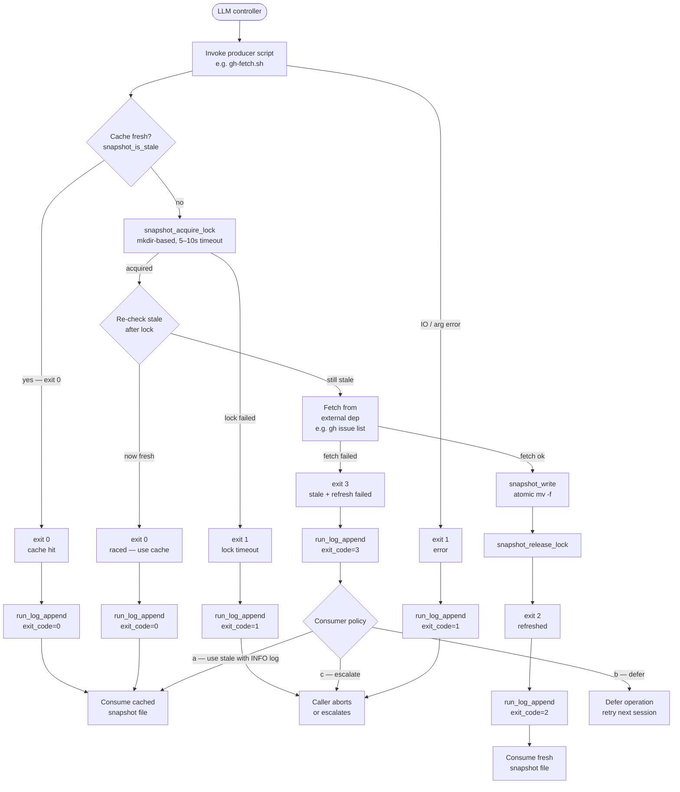

# Loop Discipline

> Scripts are append-on-exit + cache-tiered; the LLM controller treats them as
> transactional black boxes. This doc is the full grammar that
> `team.processing/SKILL.md` references (T13). Keep the skill subsection to
> ≤20 lines; read here for the complete contract.

---

## 1. The Loop

The fundamental unit of work is a four-step cycle:

```
LLM controller
  → invokes producer script (e.g. gh-fetch.sh)
  → consumes result (stdout for transient; snapshot file for persistent)
  → decides next action based on exit code
```

**Concrete example — session start:**

1. Controller calls `gh-fetch.sh --advisor kai-cto`.
2. `gh-fetch.sh` checks whether the cached snapshot at
   `<advisor-vault>/snapshots/gh/kai-cto.md` is fresh (TTL 900s via
   `snapshot_is_stale`). If fresh → exits 0. If stale → acquires
   `mkdir` lock, fetches via `gh issue list`, writes snapshot atomically via
   `snapshot_write`, exits 2.
3. Controller reads exit code. On 0 or 2 it proceeds to
   `briefing-build.sh kai-cto`, which reads the snapshot file from disk
   (never calls `gh` directly — see `read_gh_cache` in `briefing-build.sh`).
4. `briefing-build.sh` writes `briefings/kai-cto.md` and exits 0. Controller
   reads the briefing file and continues the session.

The controller never needs to know whether the data was cached or freshly
fetched — the exit code tells it, and the file path is deterministic.

---

## 2. Exit Code Contract

Established in spec 076 acceptance criterion B8. **All producer scripts MUST
follow this table.**

| Code | Meaning | Caller action |
|------|---------|---------------|
| `0` | Success — cache hit, no work done | Proceed with cached data |
| `2` | Success — refreshed, work was done | Proceed with fresh data |
| `3` | Stale + refresh failed (external dep unreachable, or TTL exhausted and caller forced refresh) | Log + defer or use stale data with warning |
| `1` | Error — invalid input, IO failure, lock timeout, schema mismatch | Abort or escalate |

**Why 2, not 0, for refresh?** Exit 0 on both paths would lose the information
that the snapshot changed. Callers that need to invalidate downstream caches
(e.g. briefing-build invalidating a rendered PDF) can branch on exit 2 without
polling the file's mtime.

`run_log_append` is called on **every** exit path via the EXIT trap. The exit
code is recorded in the JSONL row so the run log doubles as a freshness audit
trail.

---

## 3. Refresh-and-Retry Branch (exit 3)

When a producer exits 3 the consumer has three policy options:

| Policy | When to apply | Example |
|--------|--------------|---------|
| **(a) Use stale data with warning** | Non-blocking step; stale data is better than nothing | `briefing-build.sh` → `read_gh_cache` detects stale, logs `INFO: gh-cache stale … — consider rerunning gh-fetch.sh` to stderr, returns cached rows |
| **(b) Defer the operation** | The step is gating; proceeding with stale data would silently corrupt output | Advisor skill aborts the current action, schedules a retry next session |
| **(c) Escalate** | P0-level data dependency; stale data is dangerous | Surface to user immediately, refuse to proceed |

**Canonical example of policy (a):** `briefing-build.sh` → `read_gh_cache`.
The function checks `snapshot_is_stale` and, if true, emits an INFO log to
stderr but still returns the cached JSON rows. The briefing renders with a
potentially stale queue. This is acceptable because the briefing is a
best-effort orientation document, not a decision gate.

Implementing policy (b) or (c) in the calling skill: check the exit code of
the upstream producer before consuming its output file.

---

## 4. p0 Blocking Semantics

`audit-finding` entries (written by `resolve-finding.sh`) carry a `priority`
field in YAML frontmatter.

| Priority | Behavior |
|----------|---------|
| `p0` | **Blocks progress.** The calling skill MUST surface the finding in its output and refuse to proceed past the next mutation step. The caller must pass `--ack-finding <id>` explicitly to unblock, or resolve the finding (move file to `closed/`). |
| `p1` | Surface + warn. The skill may proceed but must note the finding in its response. |
| `p2` | Surface only. Informational; no gate. |

**Why hard-block on p0?** Silent progress past a p0 finding allows accumulating
technical debt that was explicitly flagged as critical. The block forces a
conscious decision by the human operator rather than silent drift.

Implementation note: lifecycle skills that read the finding store check for
`priority: p0` in open findings via frontmatter grep before any mutating step.
The `--ack-finding <id>` flag records an acknowledgment timestamp in the finding
file without closing it.

---

## 5. Composition Rules (Teaser)

Scripts compose in a producer → consumer chain:

```
gh-fetch.sh  →  briefing-build.sh  →  (rendered output)
```

Each script enforces its own exit-code contract independently. Downstream
callers MAY short-circuit on exit 1 from any upstream script. Exit 3 from
upstream propagates as policy (a/b/c) at each consumer's discretion.

**Full composition grammar** — declarative pipelines, conditional branches,
parallel dispatch across multiple advisors — is deferred to **spec 078**
(mode-routing redesign). This doc covers only the single-chain, serial case.

---

## 6. Per-Session Namespacing

When two advisor sessions overlap on the same advisor's vault (parallel
dispatches, worktrees), the optional `query`/`result` envelope templates
(T4) carry a `session_id` field in their YAML frontmatter.

```yaml
session_id: kai-cto-20260516T163000Z
```

The `session_id` distinguishes transient state so neither session overwrites
the other's intermediate results. Persistent snapshot files (written by
`snapshot_write` via atomic `mv -f`) are session-agnostic — the last writer
wins, which is safe because snapshot content is idempotent for a given TTL
window.

Envelope files are stored in a per-session temp path derived from
`session_id`; they are not committed and are cleaned up at session end.

---

## 7. Flowchart



---

## 8. Verification Checklist

Use this checklist to confirm a producer/consumer pair honors the loop contract.

**Producer (e.g. gh-fetch.sh, git-fetch.sh):**

- [ ] Sources `lib/snapshot.sh` and `lib/run-log.sh`
- [ ] Sets `exit_code` variable before any early-exit path; EXIT trap calls
      `run_log_append` with `"$exit_code"`
- [ ] Returns exactly one of `{0, 1, 2, 3}` — no other exit codes
- [ ] Cache-hit path exits 0 without acquiring the lock
- [ ] Double-check after lock acquisition before fetching (prevents double-fetch)
- [ ] Uses `snapshot_write` (atomic `mv -f`) — never writes directly to the
      final path
- [ ] Releases lock via `snapshot_release_lock` before exiting on all paths

**Consumer (e.g. briefing-build.sh):**

- [ ] Does NOT call `gh` or external deps directly — delegates to producer
- [ ] Branches on exit code (does not treat 0 and 2 identically if downstream
      invalidation is needed)
- [ ] Implements an explicit policy for exit 3 — (a) warn + use stale,
      (b) defer, or (c) escalate; never silently ignores it
- [ ] Checks for open p0 `audit-finding` entries before any mutating step
- [ ] Passes `session_id` in envelope frontmatter when running in parallel with
      another session on the same advisor vault
